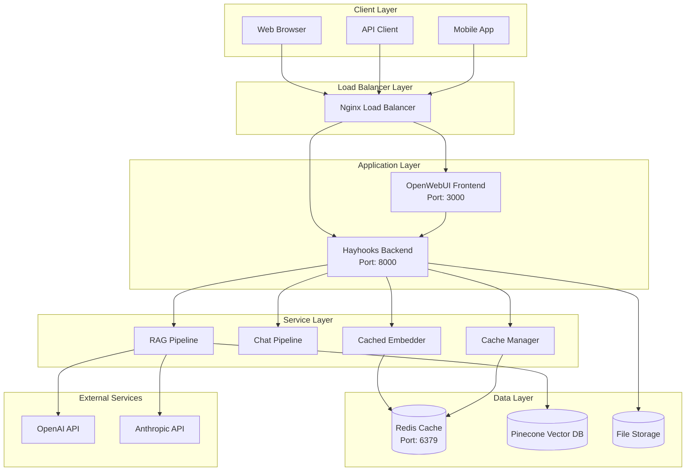
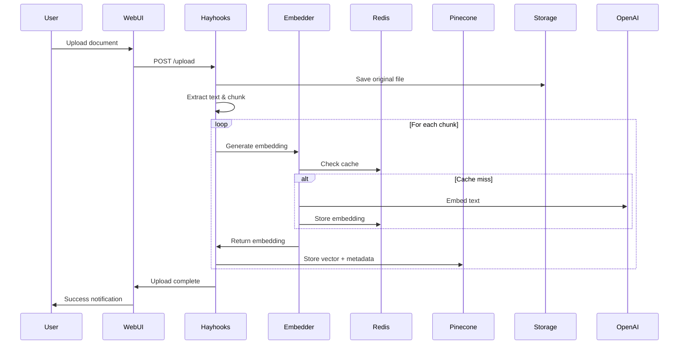
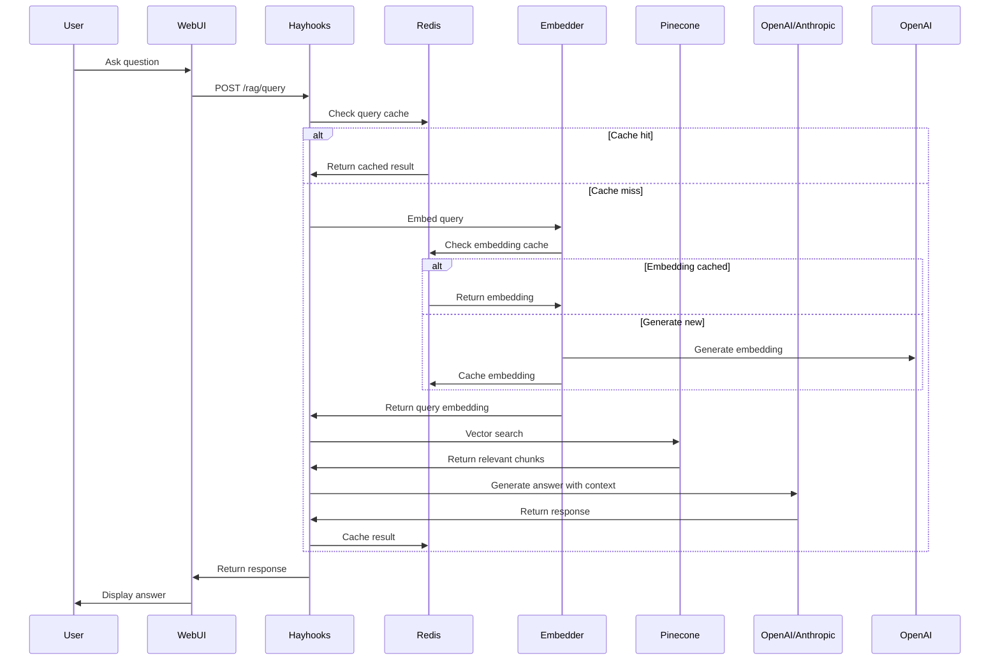
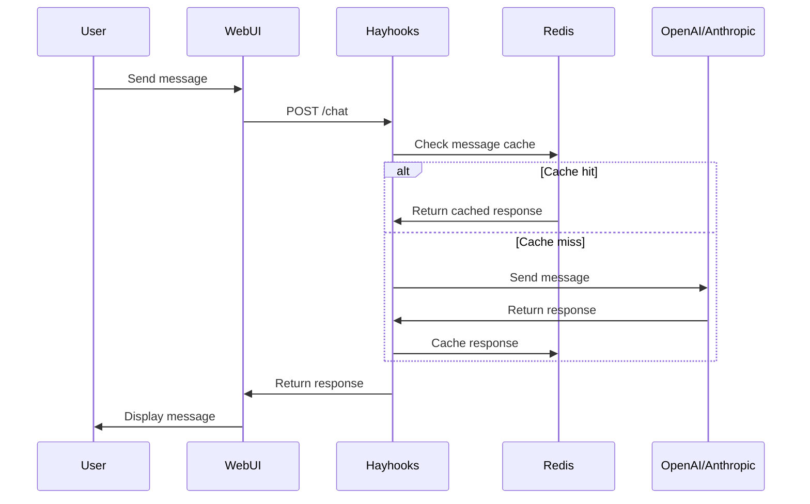

# 🏗️ System Architecture

Documentação detalhada da arquitetura do Haystack RAG System.

## 📋 Índice

- [Visão Geral](#visão-geral)
- [Componentes Principais](#componentes-principais)
- [Fluxo de Dados](#fluxo-de-dados)
- [Patterns Arquiteturais](#patterns-arquiteturais)
- [Tecnologias Utilizadas](#tecnologias-utilizadas)
- [Escalabilidade](#escalabilidade)
- [Segurança](#segurança)
- [Performance](#performance)

---

## 🔭 Visão Geral

O Haystack RAG System é uma aplicação distribuída baseada em microserviços que implementa um sistema completo de Retrieval-Augmented Generation (RAG) para processamento e consulta de documentos.

### Arquitetura High-Level



---

## 🧩 Componentes Principais

### 1. Frontend Layer

#### OpenWebUI

- **Tecnologia**: Vue.js/React (Container)
- **Responsabilidade**: Interface de usuário moderna para interação com IA
- **Funcionalidades**:
  - Chat interface
  - Document upload UI
  - Model configuration
  - Response visualization

### 2. Backend Layer

#### Hayhooks API Server

- **Tecnologia**: FastAPI + Python
- **Responsabilidade**: API principal do sistema
- **Endpoints**:
  - `/health` - Health checks
  - `/upload` - Document upload
  - `/rag/query` - RAG queries
  - `/chat` - Simple chat
  - `/api/models` - Model management
  - `/cache/*` - Cache operations

#### Componentes Internos

```python
# Estrutura do Backend
hayhooks/
├── direct_api.py           # FastAPI application
├── pipelines/
│   ├── rag_pipeline.py     # RAG pipeline implementation
│   ├── chat_pipeline.py    # Chat pipeline implementation
│   └── components/         # Custom Haystack components
├── cache_manager.py        # Redis cache management
├── cached_embedder.py      # Embedding with cache
└── utils/                  # Utility functions
```

### 3. Data Processing Layer

#### RAG Pipeline

```python
@component
class RAGPipeline:
    def __init__(self):
        self.embedder = CachedEmbedder()
        self.retriever = PineconeRetriever()
        self.generator = OpenAIGenerator()
        self.prompt_builder = PromptBuilder()

    def run(self, query: str, namespace: str) -> Dict:
        # 1. Embed query
        query_embedding = self.embedder.run(query)

        # 2. Retrieve relevant documents
        documents = self.retriever.run(
            query_embedding=query_embedding,
            namespace=namespace
        )

        # 3. Build prompt with context
        prompt = self.prompt_builder.run(
            query=query,
            documents=documents
        )

        # 4. Generate response
        response = self.generator.run(prompt)

        return response
```

#### Chat Pipeline

```python
@component
class ChatPipeline:
    def __init__(self):
        self.generator = OpenAIGenerator()
        self.prompt_builder = ChatPromptBuilder()

    def run(self, message: str) -> Dict:
        prompt = self.prompt_builder.run(message)
        response = self.generator.run(prompt)
        return response
```

### 4. Cache Layer

#### Redis Cache Manager

```python
class CacheManager:
    def __init__(self):
        self.redis = Redis(
            host='redis',
            port=6379,
            password=os.getenv('REDIS_PASSWORD')
        )

    def get_embedding(self, text_hash: str) -> Optional[List[float]]:
        """Get cached embedding by text hash"""

    def set_embedding(self, text_hash: str, embedding: List[float]):
        """Cache embedding with TTL"""

    def get_query_result(self, query_hash: str) -> Optional[Dict]:
        """Get cached query result"""

    def set_query_result(self, query_hash: str, result: Dict):
        """Cache query result with TTL"""
```

### 5. Storage Layer

#### Vector Database (Pinecone)

- **Tecnologia**: Pinecone Cloud
- **Responsabilidade**: Armazenamento e busca de vetores
- **Configuração**:
  - Dimensions: 1536 (OpenAI embeddings)
  - Metric: cosine similarity
  - Namespaces para organização

#### Cache Database (Redis)

- **Tecnologia**: Redis 7.x
- **Responsabilidade**: Cache de alto desempenho
- **Dados Armazenados**:
  - Embeddings de documentos
  - Resultados de queries
  - Metadados temporários
  - Session data

#### File Storage

- **Tecnologia**: Local filesystem ou S3-compatible
- **Responsabilidade**: Armazenamento de arquivos originais
- **Estrutura**:

```
data/
├── uploads/
│   ├── documents/
│   ├── legal-docs/
│   └── technical-specs/
└── processed/
    ├── chunks/
    └── metadata/
```

---

## 🔄 Fluxo de Dados

### 1. Document Upload Flow



### 2. RAG Query Flow



### 3. Chat Flow



---

## 🎯 Patterns Arquiteturais

### 1. Microservices Pattern

- **Implementação**: Cada componente como serviço independente
- **Comunicação**: REST APIs entre serviços
- **Benefícios**: Escalabilidade, manutenibilidade, deploy independente

### 2. Cache-Aside Pattern

```python
def get_embedding(self, text: str) -> List[float]:
    # 1. Try cache first
    cache_key = hashlib.md5(text.encode()).hexdigest()
    cached = self.cache.get(f"embedding:{cache_key}")

    if cached:
        return json.loads(cached)

    # 2. Generate if not cached
    embedding = self.openai_client.embeddings.create(
        input=text,
        model="text-embedding-3-small"
    )

    # 3. Store in cache
    self.cache.setex(
        f"embedding:{cache_key}",
        86400,  # 24h TTL
        json.dumps(embedding.data[0].embedding)
    )

    return embedding.data[0].embedding
```

### 3. Pipeline Pattern

```python
class RAGPipeline:
    def __init__(self):
        self.pipeline = Pipeline()
        self.pipeline.add_component("embedder", embedder)
        self.pipeline.add_component("retriever", retriever)
        self.pipeline.add_component("prompt_builder", prompt_builder)
        self.pipeline.add_component("llm", llm)

        # Connect components
        self.pipeline.connect("embedder", "retriever")
        self.pipeline.connect("retriever", "prompt_builder")
        self.pipeline.connect("prompt_builder", "llm")
```

### 4. Factory Pattern

```python
class ModelFactory:
    @staticmethod
    def create_llm(provider: str, model: str):
        if provider == "openai":
            return OpenAIGenerator(model=model)
        elif provider == "anthropic":
            return AnthropicGenerator(model=model)
        else:
            raise ValueError(f"Unknown provider: {provider}")
```

### 5. Repository Pattern

```python
class DocumentRepository:
    def __init__(self, vector_store, cache):
        self.vector_store = vector_store
        self.cache = cache

    def save_document(self, doc: Document):
        # Save to vector store
        self.vector_store.write_documents([doc])

        # Update cache
        self.cache.invalidate_namespace(doc.namespace)

    def find_similar(self, query_embedding: List[float], namespace: str):
        return self.vector_store.search(
            query_embedding=query_embedding,
            namespace=namespace
        )
```

---

## 💻 Tecnologias Utilizadas

### Backend Stack

| Tecnologia   | Versão | Uso                 |
| ------------ | ------ | ------------------- |
| **Python**   | 3.11+  | Linguagem principal |
| **FastAPI**  | 0.104+ | Web framework       |
| **Haystack** | 2.7+   | AI framework        |
| **Pydantic** | 2.0+   | Data validation     |
| **Uvicorn**  | 0.23+  | ASGI server         |

### Frontend Stack

| Tecnologia       | Versão | Uso                     |
| ---------------- | ------ | ----------------------- |
| **OpenWebUI**    | latest | Interface principal     |
| **Vue.js/React** | -      | Framework frontend      |
| **WebSocket**    | -      | Real-time communication |

### Data Stack

| Tecnologia     | Versão | Uso                       |
| -------------- | ------ | ------------------------- |
| **Pinecone**   | 3.0+   | Vector database           |
| **Redis**      | 7.2+   | Cache & session store     |
| **PostgreSQL** | 15+    | (Opcional) Metadata store |

### Infrastructure Stack

| Tecnologia         | Versão | Uso                  |
| ------------------ | ------ | -------------------- |
| **Docker**         | 20.10+ | Containerization     |
| **Docker Compose** | 2.0+   | Multi-container apps |
| **Nginx**          | 1.25+  | Reverse proxy        |

### External APIs

| Serviço       | Uso              |
| ------------- | ---------------- |
| **OpenAI**    | LLM & Embeddings |
| **Anthropic** | LLM alternativo  |
| **Pinecone**  | Vector storage   |

---

## 📈 Escalabilidade

### Horizontal Scaling

#### API Layer

```yaml
# docker-compose.scale.yml
services:
  hayhooks:
    deploy:
      replicas: 3
    environment:
      - WORKER_ID=${HOSTNAME}
```

#### Load Balancing

```nginx
upstream hayhooks_backend {
    least_conn;
    server hayhooks-1:8000;
    server hayhooks-2:8000;
    server hayhooks-3:8000;
}

server {
    location /api/ {
        proxy_pass http://hayhooks_backend;
    }
}
```

### Vertical Scaling

#### Resource Limits

```yaml
services:
  hayhooks:
    deploy:
      resources:
        limits:
          memory: 4g
          cpus: "2.0"
        reservations:
          memory: 2g
          cpus: "1.0"
```

### Database Scaling

#### Redis Clustering

```yaml
services:
  redis-master:
    image: redis:7-alpine
    command: redis-server --appendonly yes

  redis-replica:
    image: redis:7-alpine
    command: redis-server --replicaof redis-master 6379
```

#### Pinecone Sharding

```python
# Multiple namespaces for distribution
namespaces = [
    "docs_shard_1",
    "docs_shard_2",
    "docs_shard_3"
]

def get_shard(document_id: str) -> str:
    shard_index = hash(document_id) % len(namespaces)
    return namespaces[shard_index]
```

---

## 🔐 Segurança

### Authentication & Authorization

#### API Key Authentication

```python
from fastapi import Security, HTTPException
from fastapi.security import HTTPBearer

security = HTTPBearer()

async def verify_api_key(token: str = Security(security)):
    if token.credentials != os.getenv("API_KEY"):
        raise HTTPException(status_code=401)
    return token
```

#### JWT Tokens

```python
from jose import JWTError, jwt

def verify_token(token: str):
    try:
        payload = jwt.decode(
            token,
            SECRET_KEY,
            algorithms=[ALGORITHM]
        )
        return payload
    except JWTError:
        raise HTTPException(status_code=401)
```

### Data Protection

#### Encryption at Rest

```python
from cryptography.fernet import Fernet

class EncryptedStorage:
    def __init__(self):
        self.key = os.getenv("ENCRYPTION_KEY")
        self.cipher = Fernet(self.key)

    def encrypt_document(self, content: str) -> str:
        return self.cipher.encrypt(content.encode()).decode()

    def decrypt_document(self, encrypted: str) -> str:
        return self.cipher.decrypt(encrypted.encode()).decode()
```

#### Input Sanitization

```python
import bleach
from pydantic import validator

class QueryRequest(BaseModel):
    query: str

    @validator('query')
    def sanitize_query(cls, v):
        # Remove HTML tags and dangerous content
        return bleach.clean(v, strip=True)
```

### Network Security

#### CORS Configuration

```python
from fastapi.middleware.cors import CORSMiddleware

app.add_middleware(
    CORSMiddleware,
    allow_origins=["https://your-domain.com"],
    allow_credentials=True,
    allow_methods=["GET", "POST"],
    allow_headers=["*"],
)
```

#### Rate Limiting

```python
from slowapi import Limiter
from slowapi.util import get_remote_address

limiter = Limiter(key_func=get_remote_address)

@app.post("/rag/query")
@limiter.limit("10/minute")
async def rag_query(request: Request, query: QueryRequest):
    # Process query
    pass
```

---

## ⚡ Performance

### Caching Strategy

#### Multi-Level Cache

```python
class MultiLevelCache:
    def __init__(self):
        self.l1_cache = {}  # In-memory
        self.l2_cache = redis_client  # Redis

    def get(self, key: str):
        # Try L1 first
        if key in self.l1_cache:
            return self.l1_cache[key]

        # Try L2 (Redis)
        value = self.l2_cache.get(key)
        if value:
            self.l1_cache[key] = value
            return value

        return None
```

#### Cache Invalidation

```python
class CacheInvalidator:
    def invalidate_document(self, doc_id: str):
        # Invalidate all related cache entries
        patterns = [
            f"embedding:*{doc_id}*",
            f"query:*{doc_id}*",
            f"metadata:{doc_id}"
        ]

        for pattern in patterns:
            keys = self.redis.keys(pattern)
            if keys:
                self.redis.delete(*keys)
```

### Connection Pooling

#### Redis Pool

```python
import redis.connection

redis_pool = redis.ConnectionPool(
    host='redis',
    port=6379,
    password=os.getenv('REDIS_PASSWORD'),
    max_connections=20
)

redis_client = redis.Redis(connection_pool=redis_pool)
```

#### HTTP Pool

```python
import httpx

async_client = httpx.AsyncClient(
    limits=httpx.Limits(
        max_keepalive_connections=20,
        max_connections=100
    )
)
```

### Async Processing

#### Background Tasks

```python
from fastapi import BackgroundTasks

@app.post("/upload")
async def upload_document(
    file: UploadFile,
    background_tasks: BackgroundTasks
):
    # Save file immediately
    file_path = await save_file(file)

    # Process in background
    background_tasks.add_task(
        process_document_async,
        file_path
    )

    return {"message": "Upload started"}

async def process_document_async(file_path: str):
    # Heavy processing without blocking
    pass
```

### Database Optimization

#### Vector Search Optimization

```python
# Use appropriate top_k values
def search_vectors(query_embedding, top_k=5):
    # Don't retrieve more than needed
    return pinecone_index.query(
        vector=query_embedding,
        top_k=min(top_k, 10),  # Limit max results
        include_metadata=True
    )
```

#### Batch Processing

```python
async def process_documents_batch(documents: List[Document]):
    # Process in batches to avoid memory issues
    batch_size = 10

    for i in range(0, len(documents), batch_size):
        batch = documents[i:i + batch_size]
        await process_batch(batch)
```

---

## 📊 Monitoring & Observability

### Health Checks

```python
@app.get("/health")
async def health_check():
    checks = {
        "api": await check_api_health(),
        "redis": await check_redis_health(),
        "pinecone": await check_pinecone_health(),
        "openai": await check_openai_health()
    }

    status = "healthy" if all(checks.values()) else "unhealthy"

    return {
        "status": status,
        "checks": checks,
        "timestamp": datetime.utcnow().isoformat()
    }
```

### Metrics Collection

```python
from prometheus_client import Counter, Histogram, generate_latest

REQUEST_COUNT = Counter('requests_total', 'Total requests', ['method', 'endpoint'])
REQUEST_LATENCY = Histogram('request_duration_seconds', 'Request latency')

@app.middleware("http")
async def metrics_middleware(request: Request, call_next):
    start_time = time.time()

    response = await call_next(request)

    REQUEST_COUNT.labels(
        method=request.method,
        endpoint=request.url.path
    ).inc()

    REQUEST_LATENCY.observe(time.time() - start_time)

    return response
```

### Distributed Tracing

```python
from opentelemetry import trace

tracer = trace.get_tracer(__name__)

@tracer.start_as_current_span("rag_query")
async def process_rag_query(query: str):
    with tracer.start_as_current_span("embed_query"):
        embedding = await embed_query(query)

    with tracer.start_as_current_span("vector_search"):
        documents = await search_vectors(embedding)

    with tracer.start_as_current_span("generate_response"):
        response = await generate_response(query, documents)

    return response
```

---

**Status**: ✅ Documentação completa da arquitetura do sistema
