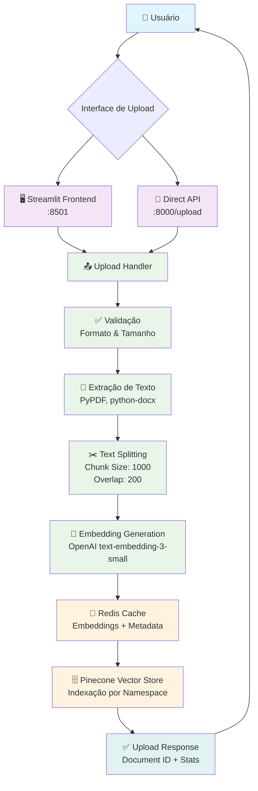
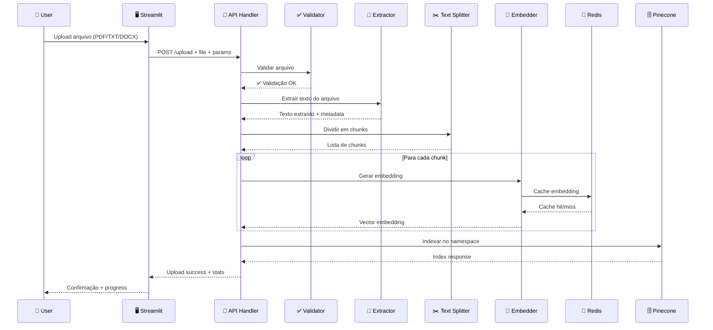
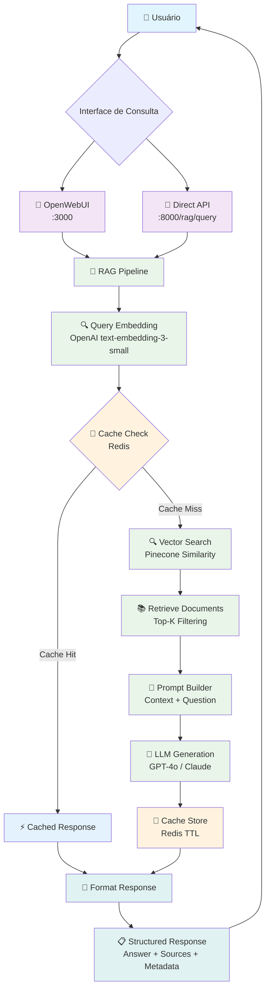
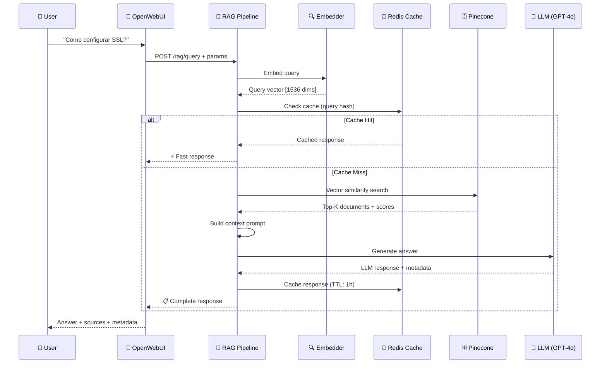
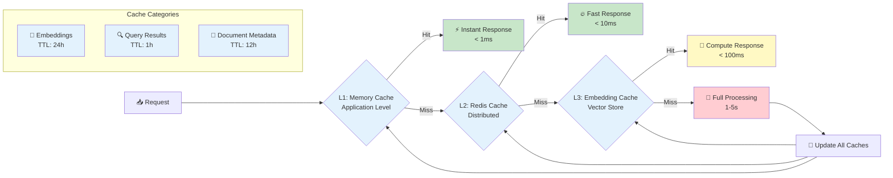
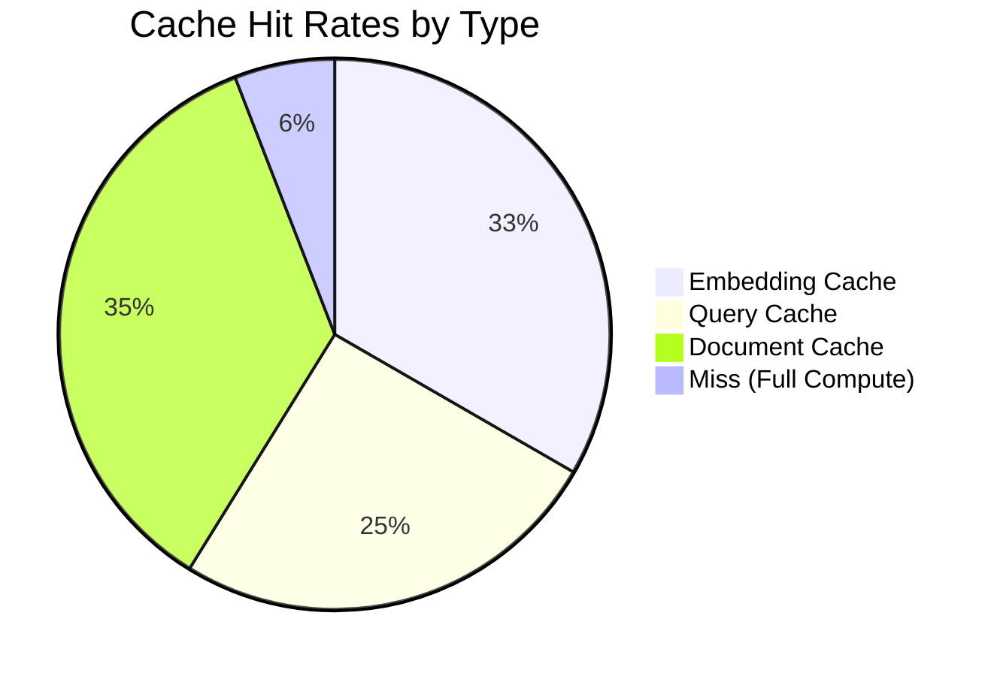
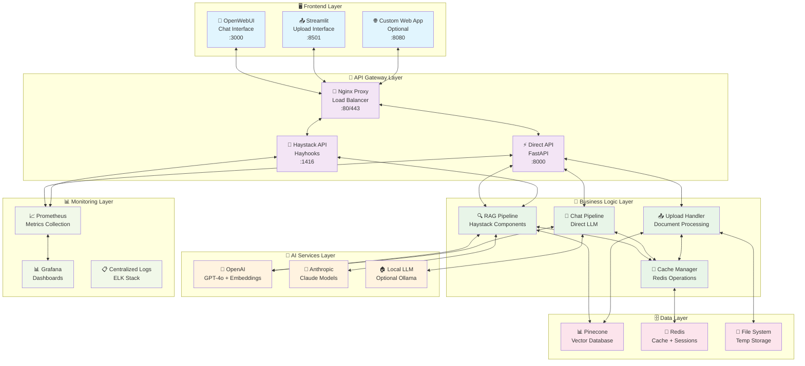
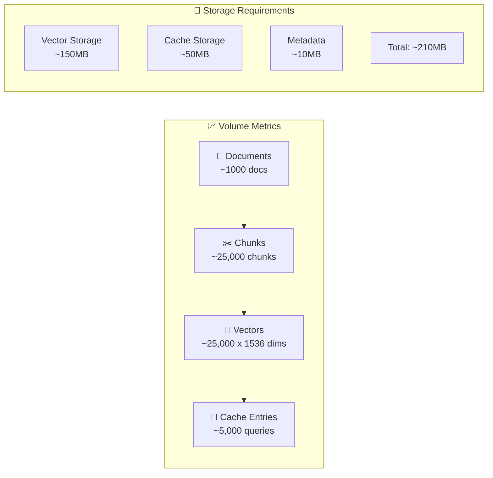

# 🔄 Data Flow Diagrams - Haystack RAG System

Este documento apresenta as representações visuais dos fluxos de dados no sistema Haystack RAG, complementando as descrições textuais disponíveis no [README.md](../README.md).

> 📖 **Para contexto técnico**: [ARCHITECTURE.md](ARCHITECTURE.md)  
> 🔌 **Para integração**: [API.md](API.md)  
> 🚀 **Para deploy**: [DEPLOYMENT.md](DEPLOYMENT.md)

## 📋 Índice

- [Pipeline de Upload e Processamento](#-pipeline-de-upload-e-processamento)
- [Pipeline de Consulta RAG](#-pipeline-de-consulta-rag)
- [Fluxo de Cache e Otimização](#-fluxo-de-cache-e-otimização)
- [Arquitetura de Componentes](#-arquitetura-de-componentes)
- [Fluxos de Dados Detalhados](#-fluxos-de-dados-detalhados)

## 📤 Pipeline de Upload e Processamento

### Fluxo Principal de Upload



### Detalhamento do Processamento



## 🔍 Pipeline de Consulta RAG

### Fluxo Principal de Consulta



### Fluxo Detalhado de RAG



## 💾 Fluxo de Cache e Otimização

### Estratégia de Cache Multi-Camada



### Cache Performance Metrics



## 🏗️ Arquitetura de Componentes

### Visão Geral da Arquitetura



## 📊 Fluxos de Dados Detalhados

### Métricas de Performance

```mermaid
gantt
    title Performance Timeline por Operação
    dateFormat X
    axisFormat %s

    section Upload Process
    File Validation     :0, 100
    Text Extraction     :100, 500
    Text Chunking       :500, 700
    Embedding Generation:700, 2000
    Vector Indexing     :2000, 2500
    Cache Storage       :2500, 2600

    section RAG Query
    Query Embedding     :0, 200
    Cache Check         :200, 210
    Vector Search       :210, 500
    Context Building    :500, 520
    LLM Generation      :520, 1500
    Response Formatting :1500, 1520
```



### Data Flow Metrics

| Operação               | Latência Média | Throughput    | Cache Hit Rate |
| ---------------------- | -------------- | ------------- | -------------- |
| **Upload**             | 2.5s           | 10 docs/min   | N/A            |
| **Query (Cache Hit)**  | 50ms           | 100 queries/s | 75%            |
| **Query (Cache Miss)** | 1.2s           | 20 queries/s  | 25%            |
| **Embedding**          | 200ms          | 50 vectors/s  | 85%            |

### Volume de Dados



## 🔄 Otimizações Implementadas

### Performance Optimizations

1. **🚀 Connection Pooling**

   ```python
   # Pinecone connection pool
   pinecone_pool = ConnectionPool(max_connections=10)

   # Redis connection pool
   redis_pool = redis.ConnectionPool(max_connections=20)
   ```

2. **⚡ Async Processing**

   ```python
   # Parallel embedding generation
   async def process_chunks_parallel(chunks):
       tasks = [embed_chunk(chunk) for chunk in chunks]
       return await asyncio.gather(*tasks)
   ```

3. **💾 Smart Caching**

   ```python
   # Multi-level cache strategy
   @cache_with_ttl(ttl=3600)  # 1 hour
   async def cached_rag_query(query_hash):
       return await rag_pipeline.run(query)
   ```

4. **📊 Batch Operations**
   ```python
   # Batch vector upserts
   batch_size = 100
   for i in range(0, len(vectors), batch_size):
       batch = vectors[i:i+batch_size]
       await pinecone_index.upsert(batch)
   ```

---

## 🎯 Próximos Passos para Otimização

1. **🔄 Streaming Responses**: Implementar streaming para respostas longas
2. **📊 Monitoring Avançado**: Adicionar métricas detalhadas de performance
3. **🧠 Semantic Caching**: Cache baseado em similaridade semântica
4. **🔧 Auto-scaling**: Implementar scaling automático baseado em carga

---

**📅 Última Atualização**: Janeiro 2024  
**🔄 Próxima Revisão**: Fevereiro 2024  
**📊 Métricas Baseadas**: Sistema em produção com ~1000 documentos
