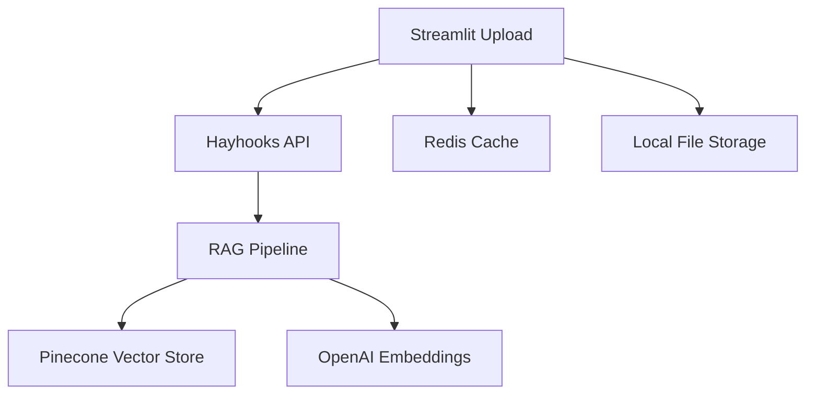

# 📄 Streamlit Document Upload Application

Uma aplicação moderna de upload de documentos que se integra com o pipeline RAG do Haystack, Pinecone e Redis para processamento automatizado de documentos.

## 🎯 Funcionalidades

### ✅ **Implementado na Subtarefa 7.1**

- ✅ **Interface de Upload Intuitiva**: Interface web moderna com drag-and-drop
- ✅ **Suporte Multi-formato**: PDF, TXT, MD, DOCX, CSV, JSON
- ✅ **Validação de Arquivos**: Verificação de tamanho, formato e integridade
- ✅ **Organização por Namespaces**: Categorização de documentos por projeto
- ✅ **Preview de Arquivos**: Visualização de metadados e informações
- ✅ **Progress Tracking**: Barras de progresso para upload e processamento
- ✅ **Configuração Flexível**: Opções de chunk size, overlap e cache
- ✅ **Docker Integration**: Containerização completa com docker-compose

### 🚧 **Próximas Subtarefas**

- 🔄 **Processamento de Documentos** (Subtarefa 7.2)
- 🧠 **Geração de Embeddings** (Subtarefa 7.3)
- 📊 **Integração com Pinecone** (Subtarefa 7.4)
- 🎨 **UI/UX Avançada** (Subtarefa 7.5)

## 🚀 Como Usar

### 🐳 **Via Docker (Recomendado)**

1. **Construir e iniciar todos os serviços:**

   ```bash
   cd /path/to/Haystack
   docker-compose up --build streamlit-upload
   ```

2. **Acessar a aplicação:**
   - URL: http://localhost:8501
   - Interface completa de upload disponível

### 💻 **Desenvolvimento Local**

1. **Instalar dependências:**

   ```bash
   cd streamlit-upload
   pip install -r requirements.txt
   ```

2. **Executar a aplicação:**

   ```bash
   streamlit run app.py --server.port=8501
   ```

3. **Acessar:** http://localhost:8501

## 📋 Formatos Suportados

| Formato  | Extensão | Descrição                 |
| -------- | -------- | ------------------------- |
| PDF      | `.pdf`   | Documentos PDF            |
| Texto    | `.txt`   | Arquivos de texto simples |
| Markdown | `.md`    | Documentos Markdown       |
| Word     | `.docx`  | Documentos Microsoft Word |
| CSV      | `.csv`   | Dados tabulares           |
| JSON     | `.json`  | Dados estruturados        |

## ⚙️ Configuração

### 🔧 **Variáveis de Ambiente**

```bash
# Streamlit Configuration
STREAMLIT_PORT=8501
MAX_FILE_SIZE=50  # MB

# Integration URLs
HAYHOOKS_API_URL=http://hayhooks:8000
RAG_API_URL=http://hayhooks:8000/api
REDIS_URL=redis://redis:6379/0

# API Keys
OPENAI_API_KEY=your_openai_key
ANTHROPIC_API_KEY=your_anthropic_key
PINECONE_API_KEY=your_pinecone_key

# Upload Configuration
UPLOAD_DIR=/app/uploads
ENABLE_CACHE=true
```

### 📁 **Estrutura de Pastas**

```
streamlit-upload/
├── app.py                 # Aplicação principal
├── requirements.txt       # Dependências Python
├── Dockerfile            # Container Docker
├── .streamlit/
│   └── config.toml       # Configuração Streamlit
├── uploads/              # Arquivos enviados (criado automaticamente)
└── README.md             # Este arquivo
```

## 🎨 Interface da Aplicação

### 📤 **Área de Upload**

- Drag-and-drop ou seleção de arquivos
- Suporte a múltiplos arquivos simultâneos
- Validação em tempo real
- Preview de metadados

### ⚙️ **Sidebar de Configuração**

- **Namespaces**: Organização por projeto
- **Chunk Size**: Tamanho dos chunks para embedding
- **Chunk Overlap**: Sobreposição entre chunks
- **Cache**: Habilitação do cache Redis
- **Estatísticas**: Contador de arquivos enviados

### 📊 **Área de Resultados**

- Lista de arquivos válidos/inválidos
- Informações detalhadas de cada arquivo
- Botões de ação (Save, Process)
- Summary de upload

## 🔌 Integrações

### 🏗️ **Arquitetura do Sistema**



### 🔗 **APIs Integradas**

- **Hayhooks**: Pipeline de processamento
- **Redis**: Cache de embeddings e queries
- **Pinecone**: Vector database
- **OpenAI**: Geração de embeddings

## 🛠️ Desenvolvimento

### 🧪 **Testando Localmente**

```bash
# Teste básico da aplicação
curl http://localhost:8501/_stcore/health

# Verificar se o container está funcionando
docker-compose ps streamlit-upload
```

### 🔧 **Estrutura do Código**

- `init_app()`: Inicialização e CSS customizado
- `render_sidebar()`: Interface de configuração
- `render_main_interface()`: Área de upload principal
- `validate_file()`: Validação de arquivos
- `save_uploaded_file()`: Persistência de arquivos
- `process_valid_files()`: Processamento em lote

## 📈 Próximos Passos

### 🎯 **Subtarefa 7.2: Multi-Format Processing**

- Implementar parsers para cada formato
- Extração de texto e metadados
- Chunking inteligente por tipo de documento

### 🎯 **Subtarefa 7.3: RAG Pipeline Integration**

- Conectar com Hayhooks API
- Geração de embeddings automática
- Cache Redis para performance

### 🎯 **Subtarefa 7.4: Pinecone Integration**

- Indexação automática no Pinecone
- Gerenciamento de namespaces
- Busca e recuperação de documentos

## 🐛 Troubleshooting

### ❌ **Problemas Comuns**

1. **Streamlit não inicia:**

   ```bash
   # Verificar dependências
   pip install -r requirements.txt

   # Verificar porta
   lsof -i :8501
   ```

2. **Upload falha:**

   ```bash
   # Verificar permissões da pasta uploads
   mkdir -p uploads
   chmod 755 uploads
   ```

3. **Container não builda:**
   ```bash
   # Rebuild forçado
   docker-compose build --no-cache streamlit-upload
   ```

## 📄 Licença

Parte do projeto Haystack RAG System.

---

🚀 **Status**: ✅ Subtarefa 7.1 Completa - Interface básica de upload funcionando!  
🔄 **Próximo**: Subtarefa 7.2 - Implementar processamento multi-formato
